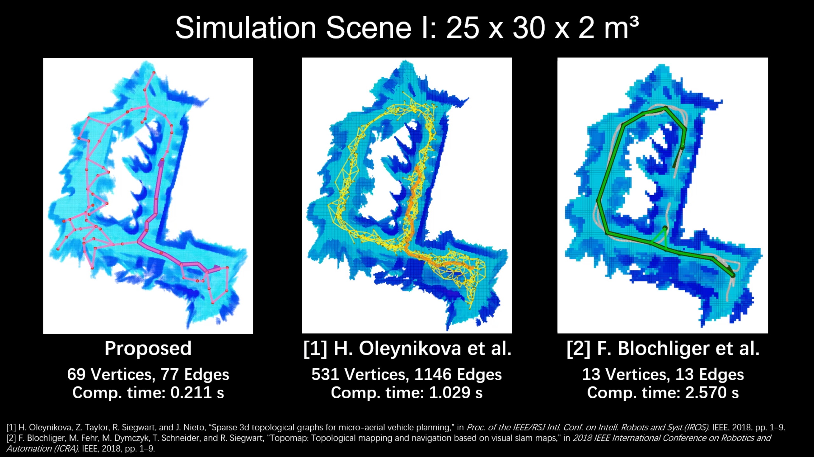
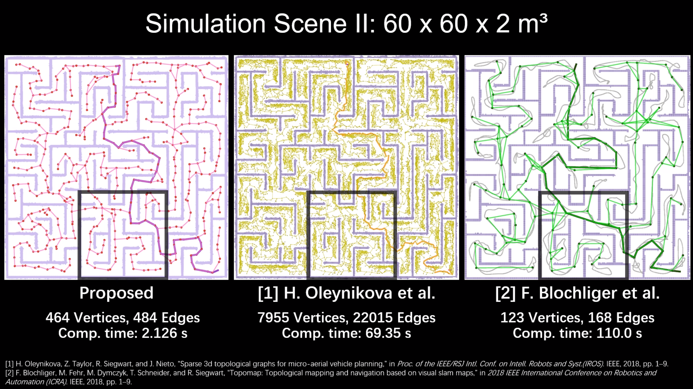
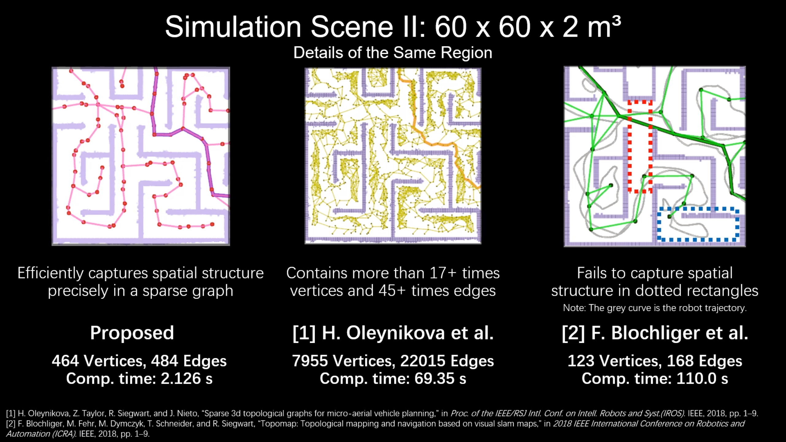
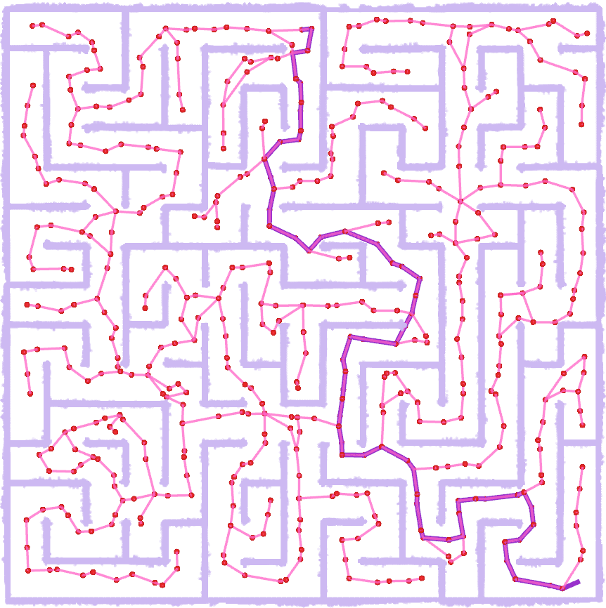
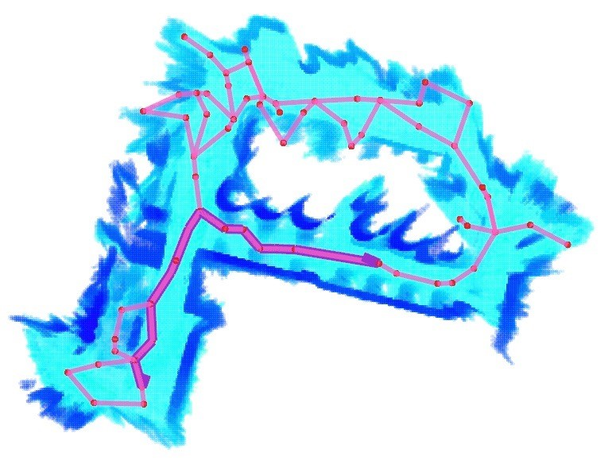
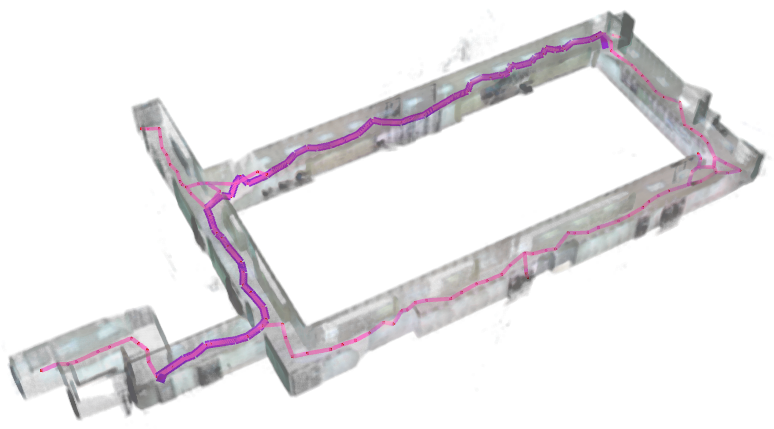
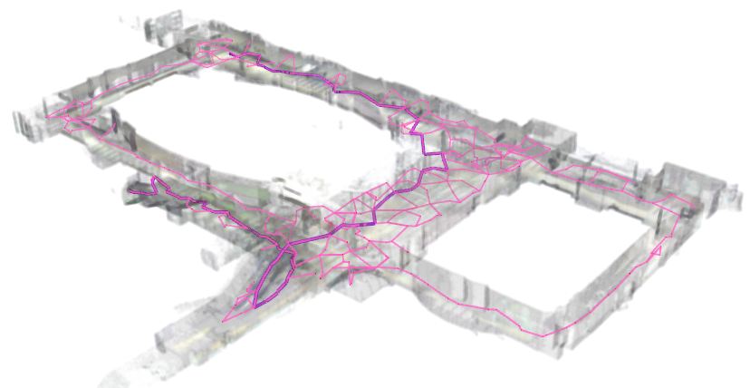

# Fast 3D Sparse Topological Skeleton Graph Generation for Mobile Robot Global Planning

We propose an efficient and flexible algorithm generating a trajectory-independent 3D sparse topological skeleton graph capturing the spatial structure of the free space.
Serving as a high-level understanding of environments, a sparse skeleton graph is beneficial for more efficient global planning.
Currently, existing solutions for skeleton graph generation suffer from several major limitations, including poor adaptiveness to different map representations, dependency on robot inspection trajectories and high computational overhead.
In our method, an efficient ray sampling and validating mechanism are adopted to find distinctive free space regions, which contributes to skeleton graph vertices, with traversability between adjacent vertices as edges.
A cycle formation scheme is also utilized to maintain skeleton graph compactness. 

__Authors__: Xinyi Chen, [Boyu Zhou](http://boyuzhou.net), [Jiarong Lin](https://github.com/ziv-lin), [Yichen Zhang](https://yzhangec.github.io/), [Fu Zhang](https://www.mech.hku.hk/academic-staff/Zhang-F) and [Shaojie Shen](https://uav.hkust.edu.hk/group/) from the [HUKST Aerial Robotics Group](https://uav.hkust.edu.hk/) and [HKU Mechatronics and Robotic Systems (MaRS) Lab](https://mars.hku.hk/).

<p align="center">
  
</p>

Benchmark comparison with state-of-the-art works demonstrates that our approach generates sparse graphs in a substantially shorter time, giving high-quality global planning paths. 

<p align="center">
  
  
  
</p>

Video is available at: [video](https://youtu.be/lzDtlfvQlpQ).

Please cite our paper if you use this project in your research:
- [__Fast 3D Sparse Topological Skeleton Graph Generation for Mobile Robot Global Planning__](https://arxiv.org/abs/2208.04248), Xinyi Chen, Boyu Zhou, Jiarong Lin, Yichen Zhang, Fu Zhang and Shaojie Shen, 2022 IEEE/RSJ International Conference on Intelligent Robots and Systems (IROS 2022).

```
@article{chen2022fast,
  title={Fast 3D Sparse Topological Skeleton Graph Generation for Mobile Robot Global Planning},
  author={Chen, Xinyi and Zhou, Boyu and Lin, Jiarong and Zhang, Yichen and Zhang, Fu and Shen, Shaojie},
  journal={arXiv preprint arXiv:2208.04248},
  year={2022}
}
```

Please kindly star :star: this project if it helps you. We take great efforts to develop and maintain it :blush:.


## Quick Start

This project has been tested on Ubuntu 18.04(ROS Melodic) and 20.04(ROS Noetic). Take Ubuntu 18.04 as an example, run the following commands to setup:

```
  cd ${YOUR_WORKSPACE_PATH}/src
  git clone https://github.com/xchencq/3D-Sparse-Skeleton.git
  cd ..
  catkin_make
```

After compilation you can start a skeleton generation demo by: 

```
  source devel/setup.bash && roslaunch polygon_generation 3D_skeleton_large_maze.launch
```

A large maze (60m x 60m x 2.5m) will appear in ```Rviz``` and you may press ```Enter``` to trigger the skeleton generation.

<p align="center">
  
</p>

## Skeleton Generation for Different Environments
We provide several sample environments as [.pcd files](https://pointclouds.org/documentation/tutorials/pcd_file_format.html). The ```machine_hall.pcd``` is an open-source real-world dataset provided by the project [mav_voxblox_planning](https://github.com/ethz-asl/mav_voxblox_planning). The ```indoor_corridor.pcd``` and ```multi_floored_hall.pcd``` are two real-world pointcloud maps collected using a LiDAR. Try these examples by:
```
  source devel/setup.bash
  roslaunch polygon_generation 3D_skeleton_machine_hall.launch
  roslaunch polygon_generation 3D_skeleton_indoor_corridor.launch
  roslaunch polygon_generation 3D_skeleton_multi_floored_hall.launch
```
_machine_hall.pcd:_
<p align="center">
  
</p>

_indoor_corridor.pcd:_
<p align="center">
  
</p>

_multi_floored_hall.pcd:_
<p align="center">
  
</p>

